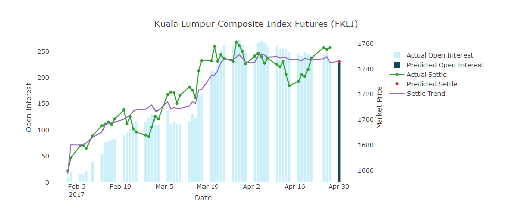

## Introduction

This app takes a user selected future date, and perform prediction on the settle price using regression model.  

### Input of the App
User will supply a future date by select from the date picker on the Input Section.  
The app will present the historical data used to predict the price, and overlay the graph with the calculated settle prediction on the selected date.  

User can also check on/off on the "Show Legend" box to show/hide the legend shall they need wider view on the graph.  

### How to Access
The app is avalilable at:
<a href="https://huic81.shinyapps.io/DevDataProductAssignmentShiny/">Kuala Lumpur Composite Index (FKLI) Prediction</a>

Source code for ui.R and server.R files are available on the GitHub:
<a href="https://github.com/huic81/DevDataProductAssignment/tree/master/DevDataProductAssignmentShiny">The GitHub Repository</a>

---

## About the Data

1. This app use live dataset that refreshed daily which consists of market history for Kuala Lumpur Composite Index Futures (FKLI) in year 2017.
2. The data retrieval API was privided by Quandl API.
3. The data is provided by an exchange holding company in Malaysia, BURSA Malaysia. The data can be validated against the historical data provided at: 
<a href="http://www.bursamalaysia.com/market/derivatives/market-statistics/historical-data/"> Historical Data in BURSA Market Statistics</a>


```
##          Date Previous Settle OpenInterest OpenInterestPrev SettlePredict
## 59 2017-02-02        0 1659.0           10                0            NA
## 58 2017-02-03     1659 1669.0           18               10            NA
## 57 2017-02-06     1669 1678.5           15               18            NA
##    OpenInterestPredict Volume
## 59                  NA     10
## 58                  NA     11
## 57                  NA     23
```

---  

## The Prediction Model  
The app fit a model to predict Settlement with correlation to the settle price of the previous records, Open Interest and the date.   


```r
formula(best_model)
```

```
## Settle ~ Previous + OpenInterest + Date
```

```r
summary(best_model)$coef
```

```
##                   Estimate   Std. Error    t value     Pr(>|t|)
## (Intercept)  -1068.5777880 2.620279e+03 -0.4078106 6.849959e-01
## Previous         0.0127049 6.635473e-03  1.9146948 6.073851e-02
## OpenInterest     0.2430040 4.388700e-02  5.5370390 8.889480e-07
## Date             0.1582845 1.523754e-01  1.0387800 3.034524e-01
```
About 84.8787652% of the variance of Settle Price can be explained by this model.  

---

## The Plot  
The app will present the prediction result in a plot.  

The Prediction of Kuala Lumpur Composite Index Futures (FKLI) Settle Price on 2017-04-30.  

---
